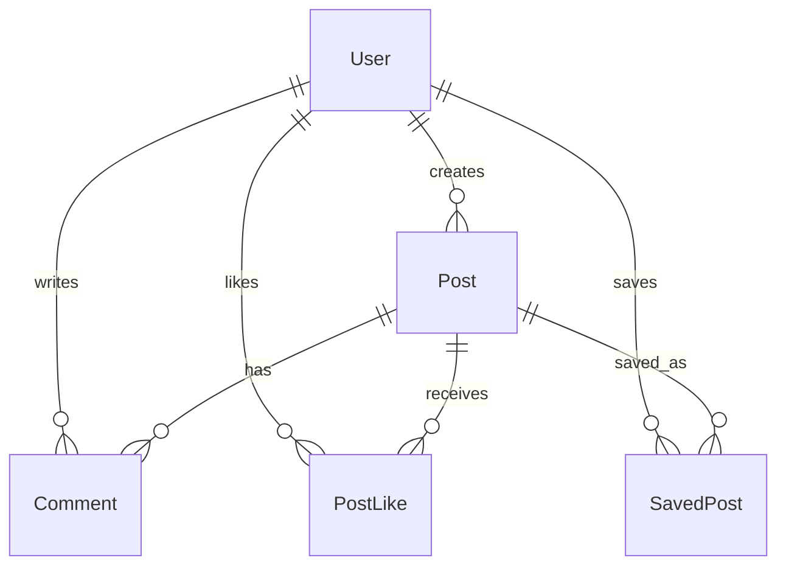

## Overview

DigiForum uses TypeScript interfaces to enforce type safety across the application. All data models are defined in `/src/lib/storage.ts` and represent the core entities of the platform.

## Core Entities

### User

Represents a registered user in the DigiForum community.

```typescript
export interface User {
  id: string;
  email: string;
  username: string;
  fullName: string;
  password: string;
  amputationType?: string;
  dateOfBirth?: string;
  profilePhoto?: string;
  registeredAt: string;
}
```

#### Fields

<ParamField path="id" type="string" required>
  Unique identifier for the user
</ParamField>

<ParamField path="email" type="string" required>
  User's email address (used for login)
</ParamField>

<ParamField path="username" type="string" required>
  Unique username displayed in posts and comments
</ParamField>

<ParamField path="fullName" type="string" required>
  User's full name for display purposes
</ParamField>

<ParamField path="password" type="string" required>
  User's password (stored in plain text in current implementation)
</ParamField>

<ParamField path="amputationType" type="string">
  Optional field indicating the user's type of physical disability (e.g., "Pierna", "Brazo", "Mano")
</ParamField>

<ParamField path="dateOfBirth" type="string">
  Optional birth date in ISO 8601 format
</ParamField>

<ParamField path="profilePhoto" type="string">
  Optional URL or data URI for the user's profile photo
</ParamField>

<ParamField path="registeredAt" type="string" required>
  Timestamp of account creation in ISO 8601 format
</ParamField>

<Warning>
The current implementation stores passwords in plain text. In production, passwords must be hashed using bcrypt or similar before storage.
</Warning>

---

### Post

Represents a community post shared by users.

```typescript
export interface Post {
  id: string;
  title: string;
  category: string;
  content: string;
  authorId: string;
  authorName: string;
  createdAt: string;
}
```

#### Fields

<ParamField path="id" type="string" required>
  Unique identifier for the post
</ParamField>

<ParamField path="title" type="string" required>
  Post title displayed in the feed
</ParamField>

<ParamField path="category" type="string" required>
  Post category (e.g., "Experiencias personales", "Preguntas y respuestas", "Recursos útiles", "Apoyo emocional", "Tecnología y prótesis")
</ParamField>

<ParamField path="content" type="string" required>
  Full text content of the post
</ParamField>

<ParamField path="authorId" type="string" required>
  ID of the user who created the post (references User.id)
</ParamField>

<ParamField path="authorName" type="string" required>
  Display name of the author (denormalized for performance)
</ParamField>

<ParamField path="createdAt" type="string" required>
  Timestamp when the post was created in ISO 8601 format
</ParamField>

---

### Comment

Represents a user comment on a post.

```typescript
export interface Comment {
  id: string;
  postId: string;
  authorId: string;
  authorName: string;
  content: string;
  createdAt: string;
}
```

#### Fields

<ParamField path="id" type="string" required>
  Unique identifier for the comment
</ParamField>

<ParamField path="postId" type="string" required>
  ID of the post this comment belongs to (references Post.id)
</ParamField>

<ParamField path="authorId" type="string" required>
  ID of the user who wrote the comment (references User.id)
</ParamField>

<ParamField path="authorName" type="string" required>
  Display name of the comment author (denormalized)
</ParamField>

<ParamField path="content" type="string" required>
  Text content of the comment
</ParamField>

<ParamField path="createdAt" type="string" required>
  Timestamp when the comment was created in ISO 8601 format
</ParamField>

---

### PostLike

Represents a user's "like" on a post.

```typescript
export interface PostLike {
  id: string;
  postId: string;
  userId: string;
  createdAt: string;
}
```

#### Fields

<ParamField path="id" type="string" required>
  Unique identifier for the like (format: `like_${timestamp}_${random}`)
</ParamField>

<ParamField path="postId" type="string" required>
  ID of the liked post (references Post.id)
</ParamField>

<ParamField path="userId" type="string" required>
  ID of the user who liked the post (references User.id)
</ParamField>

<ParamField path="createdAt" type="string" required>
  Timestamp when the like was created in ISO 8601 format
</ParamField>

<Note>
Each user can only like a post once. The combination of `postId` and `userId` must be unique.
</Note>

---

### SavedPost

Represents a post saved by a user for later reference.

```typescript
export interface SavedPost {
  id: string;
  postId: string;
  userId: string;
  createdAt: string;
}
```

#### Fields

<ParamField path="id" type="string" required>
  Unique identifier for the saved post entry (format: `save_${timestamp}_${random}`)
</ParamField>

<ParamField path="postId" type="string" required>
  ID of the saved post (references Post.id)
</ParamField>

<ParamField path="userId" type="string" required>
  ID of the user who saved the post (references User.id)
</ParamField>

<ParamField path="createdAt" type="string" required>
  Timestamp when the post was saved in ISO 8601 format
</ParamField>

<Note>
Each user can only save a post once. The combination of `postId` and `userId` must be unique.
</Note>

---

## Data Relationships



### Relationship Details

- **User → Post**: One-to-many (a user can create multiple posts)
- **User → Comment**: One-to-many (a user can write multiple comments)
- **User → PostLike**: One-to-many (a user can like multiple posts)
- **User → SavedPost**: One-to-many (a user can save multiple posts)
- **Post → Comment**: One-to-many (a post can have multiple comments)
- **Post → PostLike**: One-to-many (a post can receive multiple likes)
- **Post → SavedPost**: One-to-many (a post can be saved by multiple users)

## Type Usage Examples

### Creating a New User

```typescript
import { User } from '@/lib/storage';

const newUser: User = {
  id: crypto.randomUUID(),
  email: 'user@example.com',
  username: 'user123',
  fullName: 'John Doe',
  password: 'hashed_password_here',
  amputationType: 'Brazo',
  registeredAt: new Date().toISOString()
};
```

### Creating a New Post

```typescript
import { Post } from '@/lib/storage';

const newPost: Post = {
  id: crypto.randomUUID(),
  title: 'My Experience with Physical Therapy',
  category: 'Experiencias personales',
  content: 'Today I want to share...',
  authorId: currentUser.id,
  authorName: currentUser.fullName,
  createdAt: new Date().toISOString()
};
```

### Creating a Comment

```typescript
import { Comment } from '@/lib/storage';

const newComment: Comment = {
  id: crypto.randomUUID(),
  postId: '123',
  authorId: currentUser.id,
  authorName: currentUser.fullName,
  content: 'Great post! Thanks for sharing.',
  createdAt: new Date().toISOString()
};
```

## Next Steps

<CardGroup cols={2}>
  <Card title="Storage Functions" icon="code" href="/reference/storage">
    Learn how to read and write these data models using storage functions
  </Card>
  <Card title="Architecture Overview" icon="sitemap" href="/reference/architecture">
    Understand how data models fit into the overall architecture
  </Card>
</CardGroup>